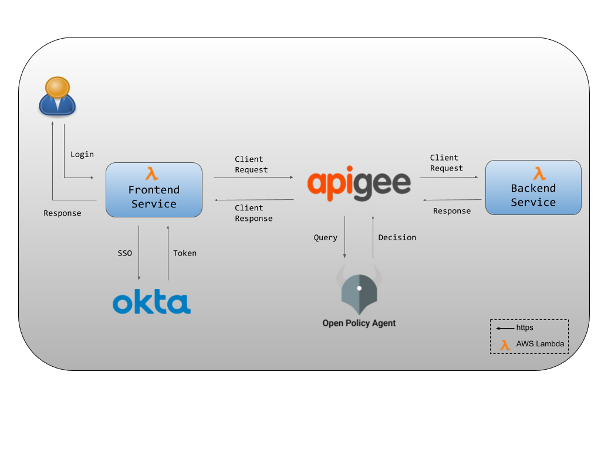
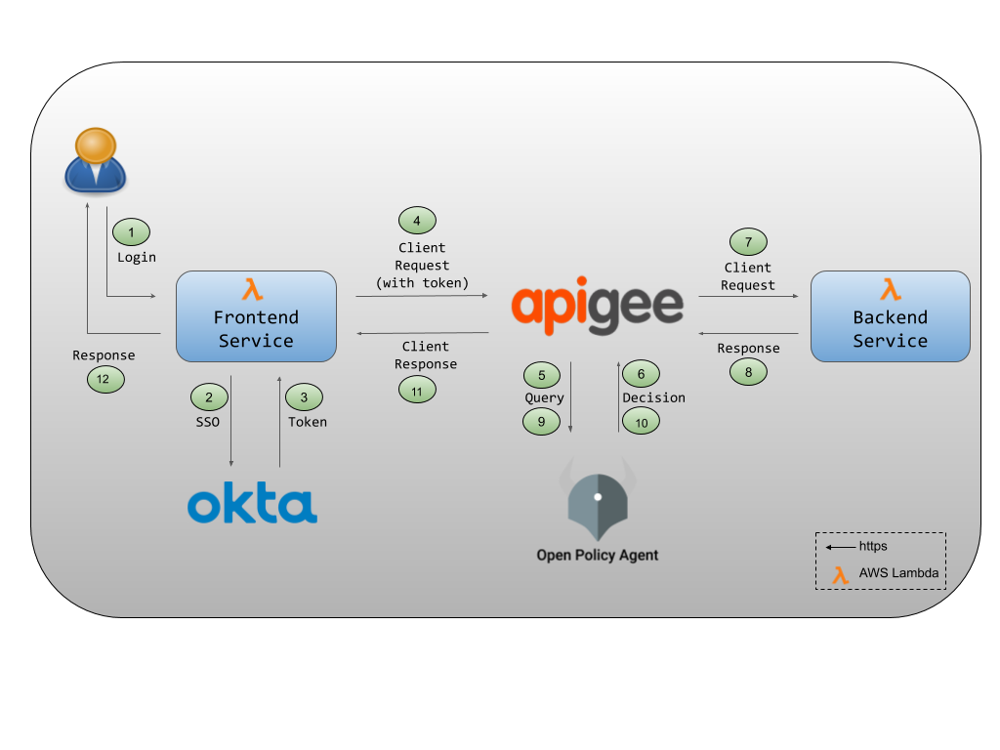
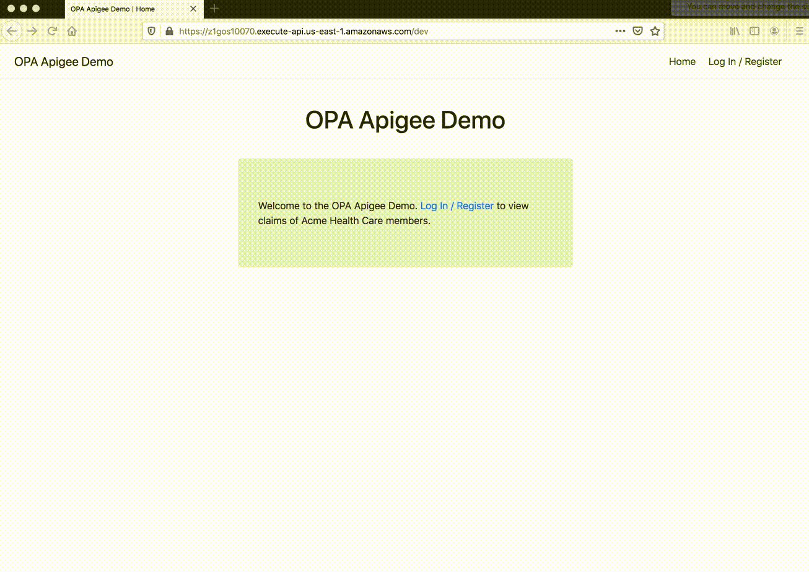

# OPA-Apigee Demo

## Overview

OPA-Apigee demo illustrates an integration between Apigee, Okta and OPA to authenticate, authorize and route client
requests to a backend service and return appropriate information back to the client.

In this demo, we have a hypothetical medical insurance provider Acme Health Care which deals with healthcare providers
on behalf of its members and processes insurance claims for medical procedures undergone by the members.

Acme Health Care stores insurance claims for each member in the `Backend` service and allows members to view them by
logging into a web portal implemented by the `Frontend` service.

More details about the demo including the format of an insurance claim, demo scenarios etc. are covered in the
[Demo Setup](#demo-setup) section.

Acme's `Frontend` service allows a user to authenticate with Okta and then forwards the user request to Apigee. In the demo,
this request is an API call to fetch a user's insurance claims.

Apigee sits in front of Acme's `Backend` service and makes a callout to OPA:

1. In the *Request* path - To authorize the incoming request, to check if the authenticated user is allowed to
access the requested API

1. In the *Response* path - To filter any sensitive fields in the response received from the `Backend` service, before
the returning the response to the user

[How it works](#how-it-works) section provides step-by-step details on the end-to-end request flow.

As seen in the figure below, the following components are part of the demo:

* **OPA**

    An open-source, general-purpose policy engine. OPA will be used to authorize client requests received by Apigee
    as well as to filter the response sent back to the client.

* **Apigee Edge**

    A platform for developing and managing APIs. By fronting services with a proxy layer, Edge provides
    an abstraction or facade for your backend service APIs. We will leverage Apigee's [Javascript Callout](https://docs.apigee.com/api-platform/reference/policies/javascript-policy)
    feature to query OPA for a policy decision. The call to OPA is executed within the context of an API proxy flow.

* **Okta**

    We will use [OpenId Connect](https://openid.net/connect/) for end-user authentication and Okta as our authorization
    server to store and manage user accounts.

* **Frontend Service**

    A Python application that provides a landing page for users to register, login, logout etc. It is deployed on
    [AWS Lambda](https://aws.amazon.com/lambda/) using [Zappa](https://github.com/Miserlou/Zappa) and is reachable at
    [https://z1gos10070.execute-api.us-east-1.amazonaws.com/dev](https://z1gos10070.execute-api.us-east-1.amazonaws.com/dev).

* **Backend Service**

    A Python application that holds insurance claims. It is deployed on [AWS Lambda](https://aws.amazon.com/lambda/)
    using [Zappa](https://github.com/Miserlou/Zappa) and is reachable at
    [https://0gqq2bi3r3.execute-api.us-east-1.amazonaws.com/dev/](https://0gqq2bi3r3.execute-api.us-east-1.amazonaws.com/dev/).



## Prerequisites

To get started, you will need to create a free [Okta](https://developer.okta.com/signup/) and [Apigee Edge](https://login.apigee.com/sign__up) account.

## How it works

The goal of this demo is to set up a basic microservice environment using *Apigee* as a gateway, *Okta* as the
authentication suite and *OPA* for authorization. The end result will look something like this:



1. A member of Acme Health Care logs into the Frontend service to see insurance claims.

1. The Frontend service redirects the user to the Okta login page if there is no active session.

1. If the user logs in successfully, Okta issues a token to the user and sends it to the Frontend service.

1. The Frontend service forwards the user's request for the protected resource to Apigee. This request includes the user's token.

1. Apigee calls out to OPA to authorize the user request. It sends the `method`, `resource path` and `token` as input to OPA.

1. OPA evaluates Apigee's query based on the policy and data loaded into it and sends a boolean policy decision back
to Apigee for enforcement. The decision indicates whether the user's request should be allowed or not.

1. If OPA denies the user request, Apigee sends a `403` http status code to the Frontend service and hence the user is not allowed to
access the resource. If OPA allows the user request, Apigee forwards the request to the Backend service to fetch the protected resource
(ie. insurance claims).

1. The Backend service sends the insurance claims to Apigee.

1. The insurance claims may contain some sensitive information which we may want to filter out before sending the response
back to the client. Apigee now sends the insurance claims object to OPA to remove sensitive fields if any. As before, Apigee also
sends the `method`, `resource path` and `token` as input to OPA.

1. Based on the policy and data, OPA evaluates the query and filters out fields in the original insurance claims object if needed.
It then returns a policy decision in the form of either the original, or a filtered version of the insurance claims object back
to Apigee.

1. Apigee sends this response to the Frontend service.

1. The Frontend service now presents this response to the logged in user.

## Demo Setup

Sample insurance claims data for `Bob` looks like below:

```json
{
  "enrolleeId": "1002",
  "enrolleePrimaryId": "1001",
  "enrolleeAge": 50,
  "canPrimaryViewClaims": true,
  "enrolleeName": "Bob Opa",
  "enrolleeType": "Secondary",
  "enrolleeClaimSummaryList": [
    {
      "claimId": "Bob - 20172376088995",
      "claimStatus": "Claim Paid",
      "claimStatusCode": "Y",
      "dateOfService": "04/25/2019",
      "provider": "Zara Medical Center",
      "enrolleeResponsibilityAmount": 0,
      "procedure": "Coronary artery bypass"
    }
  ]
}
```

Sample insurance claims data for `Jane` looks like below:

```json
{
  "enrolleeId": "1004",
  "enrolleePrimaryId": "1001",
  "enrolleeAge": 21,
  "canPrimaryViewClaims": false,
  "enrolleeName": "Jane Opa",
  "enrolleeType": "Secondary",
  "enrolleeClaimSummaryList": [
    {
      "claimId": "Jane - 20172376089998",
      "claimStatus": "Claim Paid",
      "claimStatusCode": "Y",
      "dateOfService": "03/15/2019",
      "provider": "Zara Medical Center",
      "enrolleeResponsibilityAmount": 200,
      "procedure": "Low back pain surgery"
    }
  ]
}
```

Our demo will feature a family of four, all of whom are Acme Health Care members. `Alice`(age:32) is the primary insurance holder
for the family while `Bob`(age:50), `John`(age:15) and `Jane`(age:21) are registered as secondary insurance holders.

We have registered these users with Okta, so they can now log into Acme Health Care's web portal and view their profiles,
manage their family's insurance information, update family members etc. In this demo, we will focus on the implementation
of the API that lets them view their family’s insurance claims.

We want to enforce the following policies:

* Each member should be able to see their own insurance claims
    > For example, Alice should be able to see her insurance claims

* A primary member should be able to see insurance claims of a secondary member equal to or above 18 years of age **ONLY IF** the
secondary has signed a waiver (ie. `canPrimaryViewClaims: true`)
    > For example, Alice should be able to see Bob's insurance claims but **not** Jane's

* A primary member should be able to see insurance claims of a secondary member under 18 years of age
    > For example, Alice should be able to see John's insurance claims

* If a primary member can access a secondary's insurance claims, the `procedure` field in the insurance claim object must
be hidden from the primary. It should only be included if a member accesses their own insurance claims.
    > For example, Alice should not be able to see the procedures undegone by Bob


Below is the OPA-Apigee demo in action to showcase the above policies !



## Example Policy

The demo uses the following OPA policy. Apigee queries the `allow` rule to authorize incoming user requests and the
`response` rule to return the insurance claims data back to the user.

```ruby
package authz

default allow = false

# helper to get the token payload
token = {"payload": payload} { io.jwt.decode(input.token, [_, payload, _]) }

# rule to return the original insurance claims object
response["enrolleeClaimSummaryList"] = input.object.enrolleeClaimSummaryList {
    allow_own
}

# rule to return a modified version of the insurance claims to exclude the "procedure" field
response["enrolleeClaimSummaryList"] = result {
    allow_other
    result = [ claim | val := input.object.enrolleeClaimSummaryList[_]; claim := filter(val) ]
}

# helper to filter out the "procedure" field from the insurance claims object
filter(claim) = result {
    result := {key: val | val := claim[key]; key != "procedure"  }
}

# rule to authorize incoming requests
allow {
  is_email_valid
  input.method == "GET"
  input.path = ["v1", "claims", "enrollee", _]
}

# helper rule to check if user has a "hooli.com" email id
is_email_valid {
  output := split(token.payload.email, "@")
  output[count(output) - 1] == "hooli.com"
}

# users can see their own insurance claims
allow_own {
  input.path = ["dev", "v1", "claims", "enrollee", _]
  input.method == "GET"
  token.payload.enrolleeId == input.object.enrolleeId
}

# primary can see the insurance claims of secondary users less than 18
allow_other {
  input.path = ["dev", "v1", "claims", "enrollee", _]
  input.method == "GET"
  token.payload.enrolleeType == "primary"
  input.object.enrolleeAge < 18
  token.payload.enrolleeId == input.object.enrolleePrimaryId
}

# primary can see insurance claims of secondary users greater than / equal to 18 if they have signed a waiver
allow_other {
  input.path = ["dev", "v1", "claims", "enrollee", _]
  input.method == "GET"
  token.payload.enrolleeType == "primary"
  input.object.enrolleeAge >= 18
  input.object.canPrimaryViewClaims == true
  token.payload.enrolleeId == input.object.enrolleePrimaryId
}
```

Now let's understand the above policy in detail by breaking it down into two parts:

### Request Path Policy

The request path exercises the below policy snippet. The `allow` rule returns `true` if an authenticated user with a
`hooli.com` email id makes a `GET` API call to an endpoint that returns insurance claims for a user. To enable
pattern-matching on the input path, it is represented as an array instead of a string.

```ruby
# rule to authorize incoming requests
allow {                                                         # allow is assigned true if ...
  is_email_valid                                                # is_email_valid is true AND
  input.method == "GET"                                         # method is "GET" AND
  input.path = ["v1", "claims", "enrollee", _]                  # path has the form ["v1", "claims", "enrollee", _] ie. "/v1/claims/enrollee/<some_enrollee>" 
}

# helper rule to check if user has a "hooli.com" email id
is_email_valid {                                                # is_email_valid is assigned true if ...
  output := split(token.payload.email, "@")
  output[count(output) - 1] == "hooli.com"                      # last element of the output array is "hooli.com"
}
```

### Response Path Policy

Apigee queries the `response` rule to generate the final user response. OPA lets you author policy decisions that
are more sophisticated than the allow/deny decision shown above. The `response` rule generates an object with the insurance
claims as the value.

If a user tries to access her own insurance claims, all statements in the `allow_own` rule are `true`.
As a result, the `response` rule returns the original insurance claims showing the procedures undergone by the user.

```ruby
# rule to return the original insurance claims object
response["enrolleeClaimSummaryList"] = input.object.enrolleeClaimSummaryList {
    allow_own
}

# users can see their own insurance claims
allow_own {
  input.path = ["dev", "v1", "claims", "enrollee", _]
  input.method == "GET"
  token.payload.enrolleeId == input.object.enrolleeId
}
```

On the other hand, if a primary user tries to access the insurance claims of a secondary, the `allow_other` rule is `true` if:

* secondary is under 18 **OR**

* secondary is greater than / equal to 18 **AND** secondary has signed a waiver

Now if the first statement in the `response` rule (ie `allow_other`) is `true`, the `filter` function generates a new
object without the *procedure* field for every entry in the `enrolleeClaimSummaryList` list. The decision assigned to
the `response` rule includes this updated list.

```ruby
# rule to return a modified version of the insurance claims to exclude the "procedure" field
response["enrolleeClaimSummaryList"] = result {
    allow_other
    result = [ claim | val := input.object.enrolleeClaimSummaryList[_]; claim := filter(val) ]
}

# helper to filter out the "procedure" field from the insurance claims object
filter(claim) = result {
    result := {key: val | val := claim[key]; key != "procedure"  }
}

# primary can see the insurance claims of secondary users less than 18
allow_other {
  input.path = ["dev", "v1", "claims", "enrollee", _]
  input.method == "GET"
  token.payload.enrolleeType == "primary"
  input.object.enrolleeAge < 18
  token.payload.enrolleeId == input.object.enrolleePrimaryId
}

# primary can see insurance claims of secondary users greater than / equal to 18 if they have signed a waiver
allow_other {
  input.path = ["dev", "v1", "claims", "enrollee", _]
  input.method == "GET"
  token.payload.enrolleeType == "primary"
  input.object.enrolleeAge >= 18
  input.object.canPrimaryViewClaims == true
  token.payload.enrolleeId == input.object.enrolleePrimaryId
}
```

## User Token

This is how a typical JWT generated by Okta looks like:

```bash
eyJhbGciOiJIUzUxMiIsImlhdCI6MTU5MTM5NjQ5MiwiZXhwIjoxNTkxNDAwMDkyfQ.eyJzdWIiOiIwMHVkb2I3cHRIekV2TzE5WDR4NiIsIm5hbWUiOiJBbGljZSBPcGEiLCJlbWFpbCI6ImFsaWNlQGhvb2xpLmNvbSIsInZlciI6MSwiaXNzIjoiaHR0cHM6Ly97e09LVEFfRE9NQUlOfX0vb2F1dGgyL2RlZmF1bHQiLCJhdWQiOiIwb2FkbnVkdDJLd2kwc3JyMDR4NiIsImlhdCI6MTU5MTM5NjQ5MiwiZXhwIjoxNTkxNDAwMDkyLCJqdGkiOiJJRC5vWWs5NWJiYldrWTFvX20ya2pZOVNqT0p0b1ZXY3BnMV9QT3BQMnFqVmxVIiwiYW1yIjpbInB3ZCJdLCJpZHAiOiIwMG9kbWtrNXdSQ0N2b1pjcDR4NiIsInByZWZlcnJlZF91c2VybmFtZSI6ImFsaWNlQGhvb2xpLmNvbSIsImF1dGhfdGltZSI6MTU5MTM5NjQ5MSwiYXRfaGFzaCI6Ik9mOWI0emZNWGtlZ2hXTW8wcUJFVEEiLCJlbnJvbGxlZUlkIjoiMTAwMSIsImVucm9sbGVlVHlwZSI6InByaW1hcnkiLCJhZ2UiOiIzMiJ9._ndlSaOQ2vyszqZHmP-g7sBFtiC-fG1mgCFTYq2iokdJZ24yYU1XwRzMqDygg9Wn5L3xAFBjdiUYeqbKGV9Qqg
```

The decoded JWT contains all the information about the Acme Health Care member and is used in the OPA policy.

```json
{
  "sub": "00udob7ptHzEvO19X4x6",
  "name": "Alice Opa",
  "email": "alice@hooli.com",
  "ver": 1,
  "iss": "https://{{OKTA_DOMAIN}}/oauth2/default",
  "aud": "0oadnudt2Kwi0srr04x6",
  "iat": 1591396492,
  "exp": 1591400092,
  "jti": "ID.oYk95bbbWkY1o_m2kjY9SjOJtoVWcpg1_POpP2qjVlU",
  "amr": [
    "pwd"
  ],
  "idp": "00odmkk5wRCCvoZcp4x6",
  "preferred_username": "alice@hooli.com",
  "auth_time": 1591396491,
  "at_hash": "Of9b4zfMXkeghWMo0qBETA",
  "enrolleeId": "1001",
  "enrolleeType": "primary",
  "age": "32"
}
```

## Wrap Up

This demo showed an end-to-end flow comprising a gateway, authentication and authorization setup, demonstrating how to
decouple authorization using OPA by leveraging Apigee's Javascript Callout feature.

We also saw an example of data filtering in OPA wherein we removed the `procedure` field from the insurance claim based
on the identity of the logged-in user. We performed data filtering in OPA since we know our data is small, does not
require pagination and hence, all the data needed for making the policy decision could be fit into memory.
In scenarios, where the data is too big to fit into memory, data filtering would need to be performed as close to the data source as
possible. In many cases, this would mean filtering data inside the database.

To learn more about data filtering in SQL
see [this](https://blog.openpolicyagent.org/write-policy-in-opa-enforce-policy-in-sql-d9d24db93bf4).

To learn more about data filtering in Elasticsearch
see [this](https://github.com/open-policy-agent/contrib/tree/master/data_filter_elasticsearch).

## Resources

* [How it works and Demo Setup slides](https://docs.google.com/presentation/d/1Mgyx0X5P8tPJ5lkYi_07cCHcf2ofYU8k5VQixNj4l-Y/edit?usp=sharing)

* JS scripts that callout to OPA can be found in the [apigee](./apigee) folder


